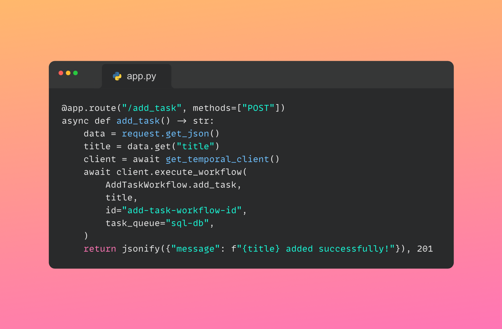

# ToDo app: Flask and Temporal




## Start the app

To start the app, run the following command:

```bash
# terminal 1
poetry run python run_worker.py
# terminal 2
poetry run python app.py
```

Now you can interact with the app using the provided API.
Choose one of the following options:

### Use the web app

You can visit the web app at http://127.0.0.1:5000 and interact with the app.

### Use the API

The provided code showcases a Flask API integrated with Temporal.
Here's how you would interact with this API using `curl` commands:

1. **Add a Task**:

   You can use this `curl` command to add a task. This is a POST request that takes a `title` for the task.

   ```bash
   curl -X POST http://127.0.0.1:5000/add_task -H "Content-Type: application/json" -d '{"title": "Hello World!"}'
   ```

2. **Get All Tasks**:

   You can fetch all tasks with this command.
   This is a simple GET request.

   ```bash
   curl -X GET http://127.0.0.1:5000/get_all_tasks
   ```

3. **Get a Specific Task by ID**:

   For retrieving a specific task using its `task_id`, you'd use this `curl` command:

   ```bash
   curl -X GET http://127.0.0.1:5000/get_task/1
   ```

   Replace `1` with the actual task ID you wish to retrieve.

4. **Complete a Task**:

   To mark a task as completed, use this `curl` command:

   ```bash
   curl -X POST http://127.0.0.1:5000/toggle_task/1
   ```

   Replace `1` with the actual task ID you wish to complete.